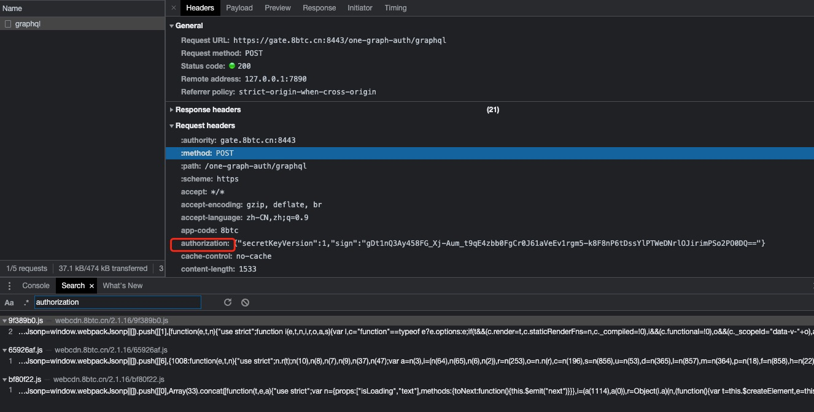
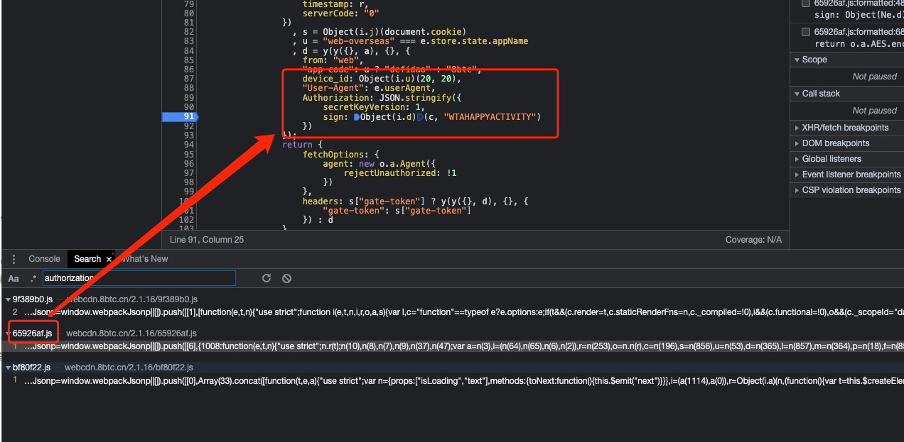
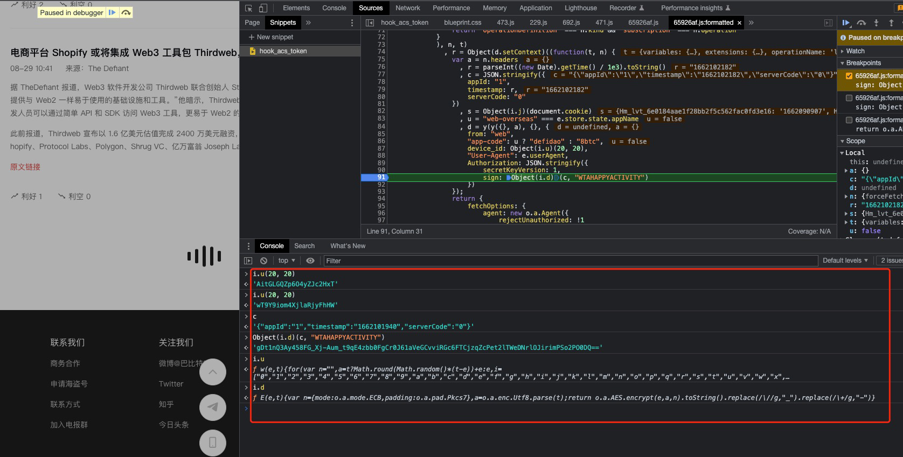

## 巴比特站点爬虫文档

- 网站 [https://www.8btc.com/flash](https://www.8btc.com/flash)
- 爬取的是 `快讯` 模块

## 反扒

- 下拉刷新更多，抓包，如下
- 经过多次测试，请求头中的 `authorization` 参数，每次请求都会变化，为必要参数。

## `authorization` 的破解

- 全局搜索该关键字即可定位到关键代码
- 下拉，点击 `查看更多`，发现断点生效

### device_id

- `device_id` 由 `Object(i.u)(20, 20)` 生成
- 控制台输入 `i.u`，并点击进去，发现如下代码:
    ```javascript
    function w(e, t) {
        for (var n = "", a = t ? Math.round(Math.random() * (t - e)) + e : e, i = ["0", "1", "2", "3", "4", "5", "6", "7", "8", "9", "a", "b", "c", "d", "e", "f", "g", "h", "i", "j", "k", "l", "m", "n", "o", "p", "q", "r", "s", "t", "u", "v", "w", "x", "y", "z", "A", "B", "C", "D", "E", "F", "G", "H", "I", "J", "K", "L", "M", "N", "O", "P", "Q", "R", "S", "T", "U", "V", "W", "X", "Y", "Z"], r = 0; r < a; r++) {
            n += i[Math.round(Math.random() * (i.length - 1))]
        }
        return n
    }
    ```
- 该代码就可以直接生成 `device_id` 参数，且不需要额外的补环境
- 其中参数 e 和 t 都是定值 20

### sign

- `sign` 由 `Object(i.d)(c, "WTAHAPPYACTIVITY")` 生成。其中 `i.d` 是函数 `E`，且接收两个参数：`c` 和 `WTAHAPPYACTIVITY`
- 其中 c 为 `'{"appId":"1","timestamp":"1662101940","serverCode":"0"}'`
- i.d 函数，点击进去之后，发现如下代码
    ```javascript
    function E(e, t) {
        var n = {
            mode: o.a.mode.ECB,
            padding: o.a.pad.Pkcs7
        }
          , a = o.a.enc.Utf8.parse(t);
        return o.a.AES.encrypt(e, a, n).toString().replace(/\//g, "_").replace(/\+/g, "-")
    }
    ```
- AES-ECB 模式，Pkcs7 填充方式