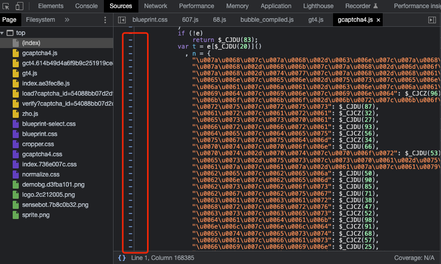
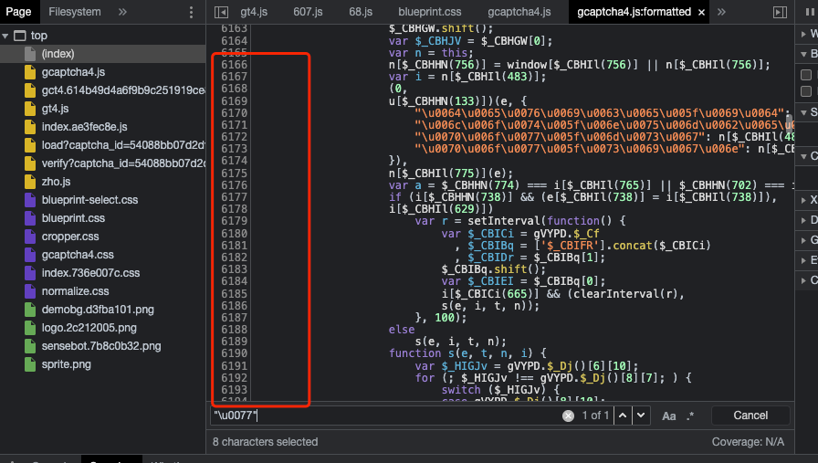
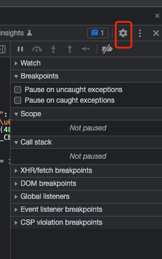
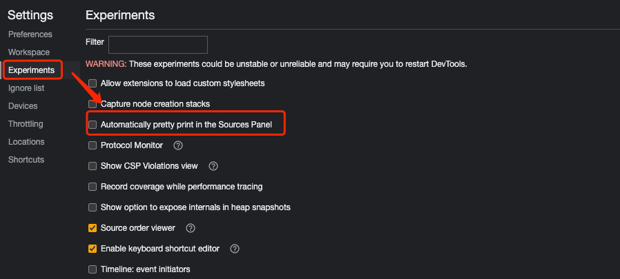

## 更改chrome设置，使显示具体行号

- 修改前
    - 左侧栏不显示行号
        - 

***

- 修改后
    - 

***

> 步骤

- 点击控制台中的设置按钮
    - 

- 在显示出来的设置页面，取消勾选 `Experiments` 设置下的 `Automatically pretty print in the Sources Pabel` 即可
    - 