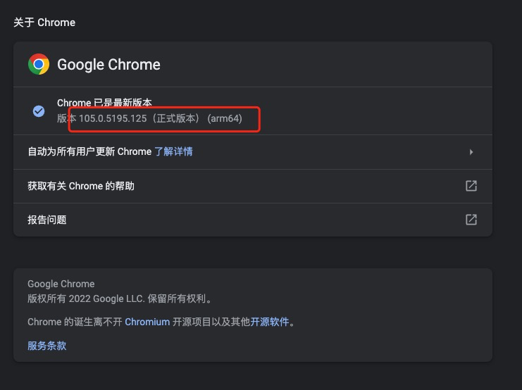
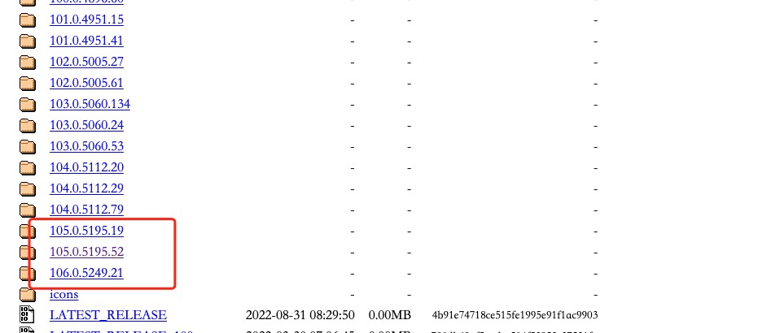

### 关于配置 `chromedriver` 环境

1. 在 `chrome` 浏览器上确认浏览器的环境 
2. 在 [http://chromedriver.storage.googleapis.com/index.html](http://chromedriver.storage.googleapis.com/index.html)
   里，找到对应的 `chromedriver` 版本 
3. 下载该`chromedriver` 版本，并在使用selenium时，指定该驱动的路径即可，如下：
    ```@python
    driver = webdriver.Chrome(executable_path=f'{os.path.abspath(os.path.dirname(os.getcwd()))}/driver_path/chromedriver',options=option)
    ```
