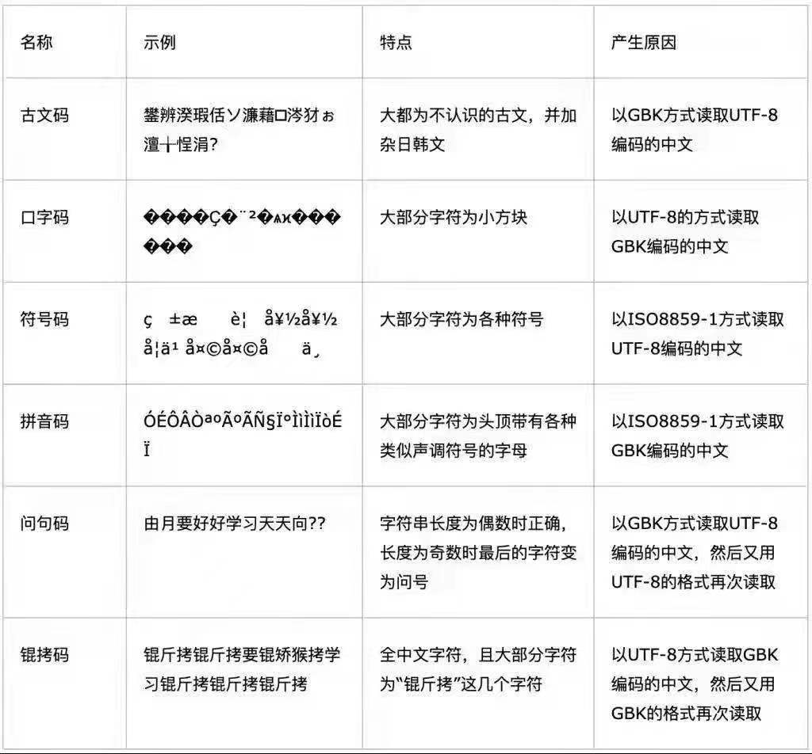

### PS: 从202207开始整理爬虫的一些逆向案例，不定时更新。本项目仅供学习交流，严禁用于任何商业和非法用途，非本人使用而产生的纠纷与一切后果均与本人无关。如有侵权，可联系本人删除（微信: `wojiaoliyf`）！

***

### 文章推荐

- [Js逆向の参数定位方法](https://blog.csdn.net/weixin_43582101/article/details/112663900)
- 参考 [Boris](https://github.com/Boris-code) 大佬的这篇文章
  > [js逆向技巧分析](https://zhuanlan.zhihu.com/p/108207751)
- 参考崔佬的这篇文章
  > [爬虫：JavaScript 逆向过程中无限 Debug 的绕过方案](https://mp.weixin.qq.com/s/MgKCZTnzS1M13ifvuuOYAQ)

- 快速识别出来加密方式
  > [CTF&爬虫：掌握这些特征，一秒识别密文加密方式](https://mp.weixin.qq.com/s/J7PTogOtVIQhUH204Qt3fA)

- [[007]爬虫系列 | 没有油候&Fiddler如何Hook？！！！](https://blog.csdn.net/weixin_41593408/article/details/119640939)

***

### 如何判断cookie是否是本地生成的

> 我们辨别 cookie 来源时，可以看 httpOnly 这一栏，如果有 √ 的是来自于服务端，如果没有 √ 的话是本地生成的。
***

### 生成 `requirements.txt`
  ```
  pipreqs reverse_practice --encoding=utf8 --force
  ```

***

### [CHANGELOG](changelog.md)

***

### 关于chrome浏览器

- 逆向定位关键参数时，source面板不显示行号。[解决办法](chrome.md)

***

### 关于 `pycharm激活码` 和 `chromedriver` 环境的配置

- [chromedriver](chromedriver.md)
- [pycharm激活码配置](pycharm激活方案汇总)

***

### 忽略某个目录或者文件

- 由于 `node_modules` 太大，且默认是可以被上传的。所以我们需要创建一个 `.gitignore` 文件，目的是忽略上传某个文件或者文件夹。
- 步骤如下:
  > 创建 `.gitignore` 文件
    ```text
        cd reverse_practice
        touch .gitignore
    ```
  > 创建好文件之后，在里边添加需要忽略的目录和文件即可
- 忽略规则如下:
  ```text
      target          // 忽略这个target目录
      angular.json    // 忽略这个angular.json文件
      log/*           // 忽略log下的所有文件
      css/*.css       // 忽略css目录下的.css文件
  ```

***

### download this repository

- 克隆本项目至本地
  > - git clone git@github.com:liyf-code/reverse_practice.git
- 准备 `python` 运行环境（version: 3.9.1）
  > - cd reverse_practice
  > - pip3 install -r requirements.txt
- 准备 `nodejs` 运行环境（version: 14.17.3）
  > - cd reverse_practice
  > - npm install

***

### 爬虫辅助工具

- curl转python代码，提高开发效率: [curlconverter](https://curlconverter.com/)
- 1024程序员开发工具箱: [1024tools](https://1024tools.com/)

***

### 文档

> ***个别网站的逆向思路及步骤，记录在py文件中***

网站名称  |  网站url地址  |  文档  |  项目位置
---|---|---|---
欧科云链  |  [链接](https://www.oklink.com/zh-cn/btc/tx-list?limit=20&pageNum=1)  |  [点击跳转](https://blog.csdn.net/qq_42598133/article/details/125619096?spm=1001.2014.3001.5501)  | [oklink](oklink)
房天下  |  [链接](https://passport.fang.com/)  |  [点击跳转](https://blog.csdn.net/qq_42598133/article/details/125658235?spm=1001.2014.3001.5501)  |  [passport_fang](passport_fang)
企名片  |  [链接](https://www.qimingpian.cn/finosda/project/pinvestment)  |  [点击跳转](https://blog.csdn.net/qq_42598133/article/details/125782518?spm=1001.2014.3001.5502)  |  [qimingpian](qimingpian)
天翼云  |  [链接](https://m.ctyun.cn/wap/main/auth/login)  |  [点击跳转](https://blog.csdn.net/qq_42598133/article/details/125867236?spm=1001.2014.3001.5501)  |  [ctyun](ctyun)
猿人学  | [链接](https://www.python-spider.com/challenge/)  |  暂无  |  [yuanrenxue](yuanrenxue)
巨潮资讯-数据中心  |  [链接](https://webapi.cninfo.com.cn/#/aiInfos)  |  暂无  |  [webapi](webapi)
MyToken  | [链接](https://www.mytokencap.com/)  |  [点击跳转](https://blog.csdn.net/qq_42598133/article/details/126285221?spm=1001.2014.3001.5501)  |  [mytokencap](mytokencap)
新榜资讯  |  [链接](https://www.newrank.cn/public/news.html)  |  暂无  |  [newrank](newrank)
粉笔网  |  [链接](https://fenbi.com/page/home)  |  暂无  |  [fenbi](fenbi)
福建省公共资源交易-交易信息  | [链接](https://ggzyfw.fujian.gov.cn/web/index.html#/business/list)  |  [点击跳转](ggzyfw_fujian/demo.py)  |  [ggzyfw_fujian](ggzyfw_fujian)
犀牛数据  | [链接](https://www.xiniudata.com/industry/newest?from=data)  |  [点击跳转](xiniu/demo.py)  |  [xiniu](xiniu)
全国建筑市场监管公共服务平台  |  [链接](http://jzsc.mohurd.gov.cn/data/company)  |  [点击跳转](jzsc/demo.py)  |  [jzsc](jzsc)
得物(m.poizon.com)  |  [链接](https://m.poizon.com/router/)  |  [点击跳转](dewu/demo.py)  |  [dewu](dewu)
网易云  |  [链接](https://music.163.com/)  |  暂无  |  [music163](music163)
易车网  |  [链接](https://car.yiche.com/yunqueq1/peizhi/)  |  [点击跳转](yiche/demo.py)  |  [yiche](yiche)
巴比特-快讯  |  [链接](https://www.8btc.com/flash)  |  [点击跳转](8btc/docs/readme.md)  |  [8btc](8btc)
加密解密-APP喵  |  [链接](https://www.appmiu.com/key/)  |  暂无  |  [appmiu](appmiu)
艺恩  |  [链接](https://www.endata.com.cn/BoxOffice/BO/Month/oneMonth.html)  |  暂无  |  [endata](endata)
中国招投标公共服务平台  |  [链接](http://ctbpsp.com/#/)  |  暂无  |  [ctbpsp](ctbpsp)
37网手游  |  [链接](https://my.37.com/login.html?url=//my.37.com/)  |  [点击跳转](my_37/demo.js)  |  [my_37](my_37)
中国·国家地名信息库  |  [链接](https://dmfw.mca.gov.cn/search.html)  |  暂无  |  [dmfw_mca](dmfw_mca)
看准网 |  [链接](https://www.kanzhun.com/firm/wage/1HV52g~~/p1.html)  |  暂无  |  [kanzhun](kanzhun)
崔佬搭建的练习网站  |  [链接](https://spa2.scrape.center/page/1)  |  暂无  |  [scrape_spa2](yuanrenxue/scrape_spa2)
浙江省核酸采样点查询  |  [链接](https://hsddcx.wsjkw.zj.gov.cn/webapp/app-mobile/epidMap)  |  [点击跳转](https://blog.csdn.net/qq_42598133/article/details/127225552?spm=1001.2014.3001.5501)  |  [hsddcx](hsddcx)
酷我音乐  |  [链接](http://www.kuwo.cn/search/list?key=%E4%B8%8B%E5%B1%B1)  |  暂无  |  [music_kuwo](music_kuwo)
领导留言板  |  [链接](http://liuyan.people.com.cn/messageSearch)  |  [点击跳转](liuyan/demo.py)  |  [liuyan](liuyan)
全国核酸检测机构查询  |  [链接](http://bmfw.www.gov.cn/hsjcjgcx/index.html?ADTAG=feiyanh5&adcode=440000)  |  [点击跳转](bmfw/demo.py)  |  [bmfw](bmfw)
美食优惠聚合  |  [链接](https://static.waitwaitpay.com/web/sd_se/index.html#/)  |  [点击跳转](waitpay/demo.py)  |  [waitpay](waitpay)
查策网  |  [链接](https://www.chacewang.com/chanye/index#)  |  暂无  |  [chacewang](chacewang)
裁判文书响应数据解密  |  [链接](https://wenshu.court.gov.cn/website/wenshu/181217BMTKHNT2W0/index.html?pageId=4c80b947ecca9eee0d410a2a65ef5e72&s8=02)  |  暂无  |  [cpws](cpws)
搜狐详情页图片地址解密  |  [链接](https://www.sohu.com/a/611710835_123753)  |  [点击跳转](souhu/demo.js)  |  [souhu](souhu)
黑猫投诉  |  [链接](https://tousu.sina.com.cn/company/view/?couid=6384912431)  |  暂无  |  [tousu_sign](tousu_sign)
猎聘  |  [链接](https://www.liepin.com/zhaopin/?inputFrom=www_index&workYearCode=0&key=&scene=input&ckId=cei1lxwcgvjwp0v613z0tdqvn0ziea1b&dq=)  |  [点击跳转](liepin/demo.js)  |  [liepin](liepin)
阿里文学  |  [链接](https://www.aliwx.com.cn/reader?bid=6813923&cid=674174)  |  暂无  |  [aliwx](aliwx)
当乐网  |  [链接](https://oauth.d.cn/auth/goLogin.html)  |  [点击跳转](oauth/demo.js)  |  [oauth](oauth)
一品威客  |  [链接](https://www.epwk.com/login.html)  |  [点击跳转](ypwk/demo.js)  |  [ypwk](ypwk)
喜马拉雅  | [链接](https://www.ximalaya.com/)  |  [点击跳转](https://mp.weixin.qq.com/s/2jYLbETc9jiq9YvnlOH72g)  |  [xmly_login](xmly_login)
滴滴外卖  |  [链接](https://passport.didichuxing.com/#/)  |  [点击跳转](didiwaimai/demo.py)  |  [didiwaimai](didiwaimai)
红人点集  |  [链接](http://www.hh1024.com/#/login?redirect=%2FrealTimeLiving)  |  [点击跳转](hh1024/demo.py)  |  [hh1024](hh1024)
毛毛租  |  [链接](https://www.maomaozu.com/#/build)  |  [点击跳转](https://blog.csdn.net/qq_42598133/article/details/129686781?spm=1001.2014.3001.5501)  |  [maomaozu](maomaozu)
惠金所登录破解  |  [链接](https://www.hfax.com/login.html#/?rsrc=https%3A%2F%2Fwww.hfax.com%2Fabout.html%23%2Fquestions)  |  [点击跳转](hjs/demo.py)  |  [hjs](hjs)
同花顺  |  [链接](http://q.10jqka.com.cn/)  |  暂无  |  [tonghuashun](tonghuashun)

***

### 一些常见的乱码

- 数据来源于爬虫交流群里边，一个大佬发的，如有侵权，请联系本人删除。
  

***

### 一些常用的hook代码

> 以下汇总常用的hook代码，来源于公众号文章 [JS 逆向之 Hook，吃着火锅唱着歌，突然就被麻匪劫了！](https://mp.weixin.qq.com/s/IYFyjVrVkHtUdCzn9arkJQ)

- <big>Hook cookies</big>
  ```javascript
  (function () {
    'use strict';
    var cookieTemp = '';
    Object.defineProperty(document, 'cookie', {
      set: function (val) {
        if (val.indexOf('__dfp') != -1) {
          debugger;
        }
        console.log('Hook捕获到cookie设置->', val);
        cookieTemp = val;
        return val;
      },
      get: function () {
        return cookieTemp;
      },
    });
  })();
  ```

- <big>Hook headers</big>
  ```javascript
  (function () {
      var org = window.XMLHttpRequest.prototype.setRequestHeader;
      window.XMLHttpRequest.prototype.setRequestHeader = function (key, value) {
          if (key == 'safe') {
              debugger;
          }
          return org.apply(this, arguments);
      };
  })();
  ```

- </big>Hook URL</big>
  ```javascript
  (function () {
      var open = window.XMLHttpRequest.prototype.open;
      window.XMLHttpRequest.prototype.open = function (method, url, async) {
          if (url.indexOf("login") != -1) {
              debugger;
          }
          return open.apply(this, arguments);
      };
  })();
  ```

- <big>Hook JSON.stringify</big>
  ```javascript
  (function() {
      var stringify = JSON.stringify;
      JSON.stringify = function(params) {
          console.log("Hook JSON.stringify ——> ", params);
          debugger;
          return stringify(params);
      }
  })();
  ```

- <big>Hook JSON.parse</big>
  ```javascript
  (function() {
      var parse = JSON.parse;
      JSON.parse = function(params) {
          console.log("Hook JSON.parse ——> ", params);
          debugger;
          return parse(params);
      }
  })();
  ```

- <big>Hook eval</big>
  ```javascript
  (function() {
      // 保存原始方法
      window.__cr_eval = window.eval;
      // 重写 eval
      var myeval = function(src) {
          console.log(src);
          console.log("=============== eval end ===============");
          debugger;
          return window.__cr_eval(src);
      }
      // 屏蔽 JS 中对原生函数 native 属性的检测
      var _myeval = myeval.bind(null);
      _myeval.toString = window.__cr_eval.toString;
      Object.defineProperty(window, 'eval', {
          value: _myeval
      });
  })();
  ```

***
